# Ubyte WebSSH Bridge

[](https://golang.org)
[](https://opensource.org/licenses/MIT)
[](https://hub.docker.com/r/ubyte/ubyte-webssh-bridge)

Ubyte WebSSH Bridge is a high-performance, enterprise-grade WebSocket-to-SSH gateway that enables secure SSH connections directly from web browsers. Built with Go, it provides a robust, scalable solution for web-based terminal access with advanced features like connection management, rate limiting, health monitoring, and comprehensive security controls.

## 🏗️ Architecture Overview

```mermaid
graph TB
    subgraph "Client Layer"
        Browser["🌐 Web Browser"]
        Terminal["📟 xterm.js Terminal"]
    end

    subgraph "Frontend Layer"
        WebUI["🎨 Web Interface"]
        Auth["🔐 Authentication Form"]
    end

    subgraph "WebSocket Layer"
        WSServer["🔌 WebSocket Server"]
        TLS["🔒 TLS Termination"]
    end

    subgraph "Application Layer"
        ConnMgr["📊 Connection Manager"]
        RateLim["⏱️ Rate Limiter"]
        MsgProc["📨 Message Processor"]
        SessionMgr["🎯 Session Manager"]
    end

    subgraph "SSH Layer"
        SSHClient["🔧 SSH Client"]
        SSHTimeouts["⏰ Timeout Manager"]
    end

    Browser --> Terminal
    Terminal --> WebUI
    WebUI --> Auth
    Auth --> TLS
    TLS --> WSServer
    WSServer --> ConnMgr
    ConnMgr --> RateLim
    ConnMgr --> SessionMgr
    SessionMgr --> MsgProc
    MsgProc --> SSHClient
    SSHClient --> SSHTimeouts
```



## ✨ Key Features

- **🔐 Enterprise Security**: TLS encryption, rate limiting, connection limits, IP whitelisting
- **📊 Advanced Monitoring**: Health checks, metrics endpoints, structured logging
- **⚡ High Performance**: Configurable buffers, connection pooling, optimized timeouts
- **🔧 Flexible Configuration**: Environment variables, command-line options, validation
- **🌐 Modern Web Interface**: Responsive design, xterm.js integration, auto-resize
- **🔄 Session Management**: Connection limits, automatic cleanup, thread-safe operations

## 🚀 Quick Start

### 1. Download & Run

```bash
# Download binary
wget https://github.com/ubyte-source/ubyte-webssh-bridge/releases/latest/download/ubyte-webssh-bridge
chmod +x ubyte-webssh-bridge

# Generate certificates
openssl req -x509 -newkey rsa:4096 -keyout certificate.key -out certificate.crt -days 365 -nodes

# Start server
./ubyte-webssh-bridge -cert=certificate.crt -key=certificate.key
```

### 2. Access Interface

Open `https://localhost:8080` and connect to SSH servers using:

```
https://localhost:8080/ws/{SSH_HOST}/{SSH_PORT}
```

### 3. Docker Deployment

```bash
docker run -d --name webssh-bridge -p 8443:8443 \
  -e COUNTRY="US" \
  -e STATE="California" \
  -e ORGANIZATION="Your Organization" \
  -e COMMON_NAME="your-domain.com" \
  ubyte/ubyte-webssh-bridge:latest
```

## 📚 Documentation

### 🔧 Core Components

| Component              | Description                                             | Documentation                                |
| ---------------------- | ------------------------------------------------------- | -------------------------------------------- |
| **Server**             | HTTP/WebSocket server, TLS termination, request routing | [📖 ws/server/](ws/server/README.md)         |
| **Configuration**      | System configuration, validation, environment variables | [📖 ws/config/](ws/config/README.md)         |
| **Connection Manager** | Session lifecycle, connection limits, resource cleanup  | [📖 ws/connection/](ws/connection/README.md) |
| **SSH Client**         | SSH connections, timeouts, RADIUS support               | [📖 ws/ssh/](ws/ssh/README.md)               |
| **Message Processing** | WebSocket messages, protocol handling, action dispatch  | [📖 ws/message/](ws/message/README.md)       |
| **Rate Limiting**      | IP-based rate limiting, whitelist management            | [📖 ws/utils/](ws/utils/README.md)           |

### 🌐 Frontend & Integration

| Component               | Description                                | Documentation                      |
| ----------------------- | ------------------------------------------ | ---------------------------------- |
| **Web Interface**       | HTML/CSS/JS frontend, xterm.js integration | [📖 frontend/](frontend/README.md) |
| **Nginx Configuration** | Reverse proxy setup, load balancing        | [📖 nginx/](nginx/README.md)       |

## ⚙️ Configuration

### Command Line Options

```bash
./ubyte-webssh-bridge \
  -address=":8443" \
  -cert="/path/to/cert.pem" \
  -key="/path/to/key.pem" \
  -debug=false
```

### Environment Variables (Docker)

```bash
# Certificate generation
COUNTRY="US"
STATE="California"
CITY="San Francisco"
ORGANIZATION="Your Organization"
COMMON_NAME="your-domain.com"

# Default SSH target (optional)
HOST="192.168.1.100"
PORT="22"
```

**👉 For complete configuration options:** [📖 Configuration Guide](ws/config/README.md)

## 🔌 API Reference

### WebSocket Connection

```
wss://{server}:{port}/ws/{ssh_host}/{ssh_port}
```

### HTTP Endpoints

- `GET /health` - Health check and status
- `GET /metrics` - Performance metrics and statistics

**👉 For complete API documentation:** [📖 Server Documentation](ws/server/README.md)

## 🐳 Deployment

### Docker Compose

```yaml
version: "3.8"
services:
  webssh-bridge:
    image: ubyte/ubyte-webssh-bridge:latest
    ports:
      - "8443:8443"
    environment:
      - COUNTRY=US
      - STATE=California
      - ORGANIZATION=Your Organization
      - COMMON_NAME=your-domain.com
    restart: unless-stopped
    healthcheck:
      test: ["CMD", "curl", "-f", "https://localhost:8443/health"]
      interval: 30s
      timeout: 10s
      retries: 3
```

### Production Checklist

- [ ] Valid TLS certificates installed
- [ ] Rate limiting configured
- [ ] Connection limits set
- [ ] Monitoring enabled
- [ ] Firewall rules configured
- [ ] SSH servers hardened

## 🔒 Security Features

- **🔐 TLS Encryption**: Mandatory HTTPS/WSS connections
- **⏱️ Rate Limiting**: Configurable per-IP with whitelist support
- **📊 Connection Limits**: Global and per-host restrictions
- **🛡️ Input Validation**: Comprehensive message validation
- **📝 Audit Logging**: Structured logging with detailed events

**👉 For security best practices:** [📖 Security Documentation](ws/server/README.md#-security-features)

## 📊 Monitoring

### Health Check

```bash
curl -k https://localhost:8443/health
```

### Metrics

```bash
curl -k https://localhost:8443/metrics
```

**👉 For monitoring setup:** [📖 Server Monitoring](ws/server/README.md#-monitoring-endpoints)

## 🛠️ Development

### Build from Source

```bash
git clone https://github.com/ubyte-source/ubyte-webssh-bridge.git
cd ubyte-webssh-bridge/ws
go build -o ubyte-webssh-bridge .
```

### Project Structure

```
ubyte-webssh-bridge/
├── README.md                 # This documentation
├── LICENSE                   # MIT license
├── Dockerfile               # Docker configuration
├── frontend/                # Web interface [📖](frontend/README.md)
├── nginx/                   # Reverse proxy config [📖](nginx/README.md)
└── ws/                      # Go application source
    ├── main.go              # Application entry point
    ├── config/              # Configuration management [📖](ws/config/README.md)
    ├── server/              # HTTP/WebSocket server [📖](ws/server/README.md)
    ├── connection/          # Connection management [📖](ws/connection/README.md)
    ├── message/             # Message processing [📖](ws/message/README.md)
    ├── ssh/                 # SSH client [📖](ws/ssh/README.md)
    └── utils/               # Utilities & rate limiting [📖](ws/utils/README.md)
```

**👉 For development setup:** [📖 Development Guide](ws/config/README.md#-testing-configuration)

## 🔧 Troubleshooting

### Common Issues

- **Connection Refused**: Check SSH server accessibility and firewall rules
- **Authentication Failed**: Verify credentials and SSH server settings
- **Rate Limited**: Check IP whitelist or increase rate limits
- **Certificate Errors**: Use valid certificates or add `-k` for testing

**👉 For detailed troubleshooting:** [📖 Connection Troubleshooting](ws/connection/README.md#-troubleshooting)

## 🤝 Contributing

We welcome contributions! Areas of interest:

- **Security enhancements** and authentication methods
- **Performance optimizations** and scalability improvements
- **Protocol support** and WebSocket extensions
- **Documentation** and examples

### Getting Started

1. Fork the repository
2. Create a feature branch
3. Make your changes with tests
4. Submit a pull request

## 📄 License

This project is licensed under the MIT License - see the [LICENSE](LICENSE) file for details.

## 🙏 Acknowledgments

- **Go Team** - Excellent programming language
- **Gorilla WebSocket** - High-performance WebSocket library
- **xterm.js** - Modern terminal emulation
- **Community** - Contributors and users

---

**⭐ Star this repository if you find it useful!**

For questions, issues, or contributions, visit our [GitHub repository](https://github.com/ubyte-source/ubyte-webssh-bridge).
