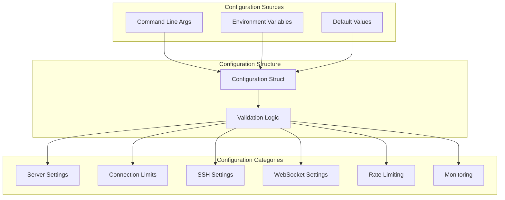

# Configuration Management

This package handles all configuration aspects of the Ubyte WebSSH Bridge, providing a comprehensive configuration system with sensible defaults and validation.

## 🏗️ Architecture



## 📋 Configuration Structure

### Server Settings

```go
// Server configuration
ListenAddress   string // Server bind address (default: ":8080")
CertificateFile string // TLS certificate path (default: "/data/certificate.crt")
KeyFile         string // TLS private key path (default: "/data/certificate.key")
DebugMode       bool   // Enable debug logging (default: false)
```

### Connection Limits

```go
// Connection management
MaxConnections        int           // Global connection limit (default: 1000)
MaxConnectionsPerHost int           // Per-host connection limit (default: 10)
ConnectionTimeout     time.Duration // Connection timeout (default: 30s)
```

### SSH Settings

```go
// SSH client configuration
SSHConnectTimeout   time.Duration // SSH TCP connect timeout (default: 10s)
SSHAuthTimeout      time.Duration // SSH auth timeout (default: 45s)
SSHHandshakeTimeout time.Duration // SSH handshake timeout (default: 60s)
```

### WebSocket Settings

```go
// WebSocket configuration
WebSocketReadBufferSize   int           // Read buffer size (default: 8192)
WebSocketWriteBufferSize  int           // Write buffer size (default: 8192)
WebSocketHandshakeTimeout time.Duration // Handshake timeout (default: 30s)
WebSocketReadLimit        int64         // Max message size (default: 512KB)
```

### Rate Limiting

```go
// Rate limiting configuration
RateLimitInterval  time.Duration // Rate limit window (default: 2s)
RateLimitBurst     int           // Max requests per window (default: 10)
RateLimitPerIP     bool          // Enable per-IP limiting (default: true)
RateLimitWhitelist []string      // IP whitelist
```

### Monitoring

```go
// Monitoring configuration
EnableHealthCheck bool   // Enable /health endpoint (default: true)
HealthCheckPath   string // Health check path (default: "/health")
EnableMetrics     bool   // Enable /metrics endpoint (default: false)
MetricsPath       string // Metrics path (default: "/metrics")
```

## 🛠️ Usage Examples

### Basic Configuration

```go
// Create default configuration
cfg := config.DefaultConfiguration()

// Override specific settings
cfg.ListenAddress = ":8443"
cfg.DebugMode = true
cfg.MaxConnections = 5000

// Validate configuration
if err := cfg.Validate(); err != nil {
    log.Fatalf("Invalid configuration: %v", err)
}
```

### Production Configuration

```go
// Production-ready configuration
cfg := &config.Configuration{
    ListenAddress:             ":443",
    CertificateFile:           "/etc/ssl/certs/server.crt",
    KeyFile:                   "/etc/ssl/private/server.key",
    DebugMode:                 false,
    MaxConnections:            10000,
    MaxConnectionsPerHost:     100,
    ConnectionTimeout:         60 * time.Second,
    SSHConnectTimeout:         15 * time.Second,
    SSHAuthTimeout:            90 * time.Second,
    SSHHandshakeTimeout:       120 * time.Second,
    WebSocketReadBufferSize:   16384,
    WebSocketWriteBufferSize:  16384,
    WebSocketHandshakeTimeout: 30 * time.Second,
    WebSocketReadLimit:        1024 * 1024,
    RateLimitInterval:         5 * time.Second,
    RateLimitBurst:            20,
    RateLimitPerIP:            true,
    RateLimitWhitelist:        []string{"192.168.1.0/24"},
    EnableHealthCheck:         true,
    HealthCheckPath:           "/health",
    EnableMetrics:             true,
    MetricsPath:               "/metrics",
}
```

### Environment-based Configuration

```go
// Configuration with environment variables
cfg := config.DefaultConfiguration()

// Override from environment
if debugMode := os.Getenv("DEBUG_MODE"); debugMode == "true" {
    cfg.DebugMode = true
}

if listenAddr := os.Getenv("LISTEN_ADDRESS"); listenAddr != "" {
    cfg.ListenAddress = listenAddr
}

if certFile := os.Getenv("TLS_CERT_FILE"); certFile != "" {
    cfg.CertificateFile = certFile
}

if keyFile := os.Getenv("TLS_KEY_FILE"); keyFile != "" {
    cfg.KeyFile = keyFile
}
```

## ⚡ Performance Tuning

### High-Traffic Configuration

```go
// Optimized for high traffic
cfg := config.DefaultConfiguration()
cfg.MaxConnections = 50000
cfg.MaxConnectionsPerHost = 500
cfg.WebSocketReadBufferSize = 32768
cfg.WebSocketWriteBufferSize = 32768
cfg.WebSocketReadLimit = 2 * 1024 * 1024
cfg.ConnectionTimeout = 120 * time.Second
```

### RADIUS-Optimized Configuration

```go
// Optimized for RADIUS authentication
cfg := config.DefaultConfiguration()
cfg.SSHAuthTimeout = 120 * time.Second      // Allow RADIUS delays
cfg.SSHHandshakeTimeout = 180 * time.Second // Extended handshake
cfg.SSHConnectTimeout = 20 * time.Second    // Network resilience
```

### Low-Latency Configuration

```go
// Optimized for low latency
cfg := config.DefaultConfiguration()
cfg.WebSocketHandshakeTimeout = 10 * time.Second
cfg.SSHConnectTimeout = 5 * time.Second
cfg.ConnectionTimeout = 15 * time.Second
cfg.RateLimitInterval = 1 * time.Second
```

## 🔒 Security Considerations

### Secure Configuration

```go
// Security-focused configuration
cfg := config.DefaultConfiguration()
cfg.RateLimitBurst = 5                      // Strict rate limiting
cfg.RateLimitInterval = 10 * time.Second    // Longer windows
cfg.MaxConnectionsPerHost = 5               // Limited per-host connections
cfg.EnableMetrics = false                   // Disable metrics in production
cfg.DebugMode = false                       // No debug information
```

### Whitelist Configuration

```go
// IP whitelist configuration
cfg := config.DefaultConfiguration()
cfg.RateLimitWhitelist = []string{
    "192.168.1.0/24",    // Internal network
    "10.0.0.0/8",        // Private network
    "172.16.0.0/12",     // Private network
    "127.0.0.1",         // Localhost
}
```

## 🧪 Testing Configuration

### Test Configuration

```go
// Configuration for testing
cfg := &config.Configuration{
    ListenAddress:             ":0", // Random port
    CertificateFile:           "test.crt",
    KeyFile:                   "test.key",
    DebugMode:                 true,
    MaxConnections:            10,
    MaxConnectionsPerHost:     2,
    ConnectionTimeout:         5 * time.Second,
    SSHConnectTimeout:         2 * time.Second,
    SSHAuthTimeout:            5 * time.Second,
    SSHHandshakeTimeout:       10 * time.Second,
    WebSocketReadBufferSize:   1024,
    WebSocketWriteBufferSize:  1024,
    WebSocketHandshakeTimeout: 5 * time.Second,
    WebSocketReadLimit:        64 * 1024,
    RateLimitInterval:         1 * time.Second,
    RateLimitBurst:            3,
    RateLimitPerIP:            true,
    EnableHealthCheck:         true,
    EnableMetrics:             true,
}
```

## 📊 Configuration Validation

The `Validate()` method ensures configuration integrity:

```go
func (c *Configuration) Validate() error {
    // Address validation
    if c.ListenAddress == "" {
        return fmt.Errorf("listen address cannot be empty")
    }

    // Connection limits validation
    if c.MaxConnections <= 0 {
        return fmt.Errorf("max connections must be positive")
    }

    if c.MaxConnectionsPerHost <= 0 {
        return fmt.Errorf("max connections per host must be positive")
    }

    // Timeout validation
    if c.SSHConnectTimeout <= 0 {
        return fmt.Errorf("SSH connect timeout must be positive")
    }

    if c.SSHAuthTimeout <= 0 {
        return fmt.Errorf("SSH auth timeout must be positive")
    }

    if c.SSHHandshakeTimeout <= 0 {
        return fmt.Errorf("SSH handshake timeout must be positive")
    }

    return nil
}
```

## 🔍 Configuration Best Practices

1. **Always validate configuration** before using it
2. **Use environment variables** for sensitive data
3. **Set appropriate timeouts** based on network conditions
4. **Configure rate limiting** based on expected traffic
5. **Enable monitoring** in production environments
6. **Use TLS certificates** from trusted authorities
7. **Set resource limits** to prevent DoS attacks
8. **Test configuration changes** in staging first

## 📖 Related Documentation

- [Server Configuration](../server/README.md) - HTTP/WebSocket server setup
- [Connection Management](../connection/README.md) - Connection handling
- [SSH Configuration](../ssh/README.md) - SSH client settings
- [Rate Limiting](../utils/README.md) - Rate limiting configuration
