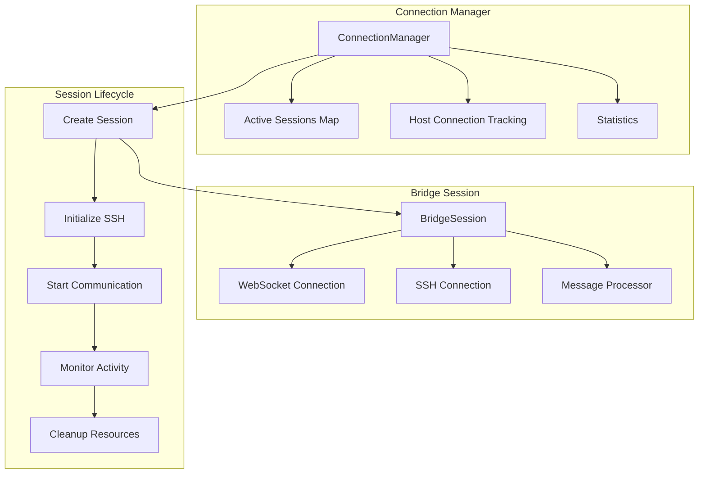
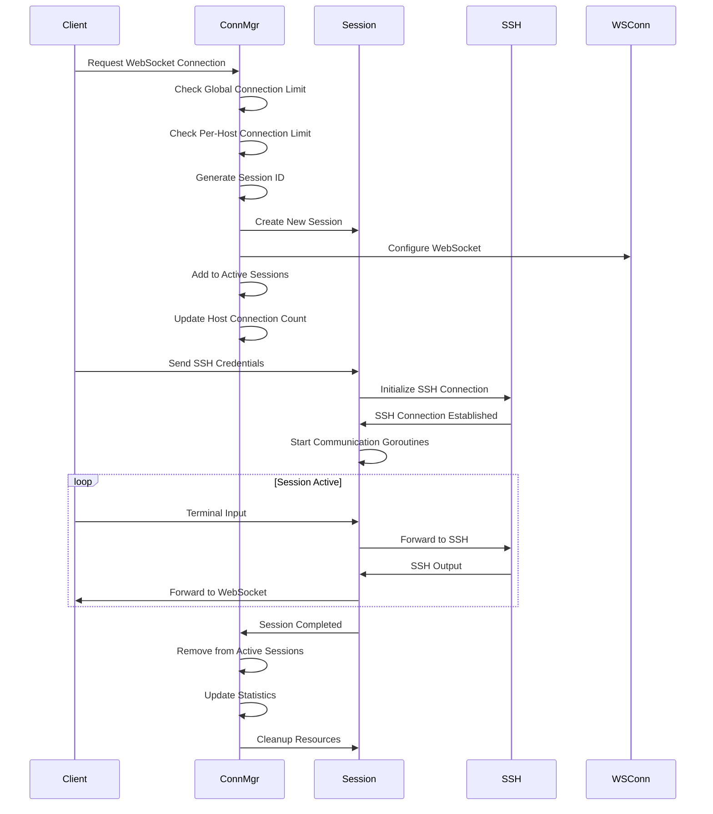

# Connection Management

This package handles all WebSocket-SSH bridge connections, managing session lifecycles, connection limits, and resource cleanup.

## 🏗️ Architecture



## 🔧 Core Components

### Connection Manager

The main orchestrator for all connection-related operations:

```go
type ConnectionManager struct {
    // Configuration
    config *config.Configuration
    logger *logrus.Logger

    // Session management
    activeSessions map[string]*BridgeSession
    sessionsMutex  sync.RWMutex

    // Host connection tracking
    hostConnections map[string]int
    hostMutex       sync.RWMutex

    // Statistics
    totalSessions      int64
    successfulSessions int64
    failedSessions     int64
    statsMutex         sync.RWMutex
}
```

### Bridge Session

Individual WebSocket-SSH bridge session:

```go
type BridgeSession struct {
    // Identification
    ID            string
    TargetAddress string
    ClientIP      string

    // Connections
    WebSocketConn *websocket.Conn
    SSHClient     *ssh.SSHClient
    SSHSession    *ssh.SSHSession

    // Message processing
    MessageProcessor *message.MessageProcessor

    // Context and synchronization
    Context    context.Context
    CancelFunc context.CancelFunc
    WaitGroup  *sync.WaitGroup

    // Connection state
    IsActive     bool
    IsClosed     bool
    CreatedAt    time.Time
    LastActivity time.Time

    // Logger
    Logger *logrus.Logger
}
```

## 🔄 Session Lifecycle

### Session Creation Flow



### Session Management Methods

#### Creating Sessions

```go
func (manager *ConnectionManager) CreateSession(webSocketConn *websocket.Conn, targetAddress string, clientIP string) (*BridgeSession, error) {
    // Check global connection limit
    if err := manager.checkGlobalConnectionLimit(); err != nil {
        return nil, err
    }

    // Check per-host connection limit
    if err := manager.checkHostConnectionLimit(targetAddress); err != nil {
        return nil, err
    }

    // Generate unique session ID
    sessionID, err := manager.generateSessionID()
    if err != nil {
        return nil, fmt.Errorf("failed to generate session ID: %v", err)
    }

    // Create new session
    session := NewBridgeSession(sessionID, webSocketConn, targetAddress, clientIP, manager.logger)

    // Configure WebSocket
    if err := manager.configureWebSocket(webSocketConn); err != nil {
        return nil, fmt.Errorf("failed to configure WebSocket: %v", err)
    }

    // Add to active sessions
    manager.sessionsMutex.Lock()
    manager.activeSessions[sessionID] = session
    manager.sessionsMutex.Unlock()

    // Update host connection count
    manager.hostMutex.Lock()
    manager.hostConnections[targetAddress]++
    manager.hostMutex.Unlock()

    return session, nil
}
```

#### Initializing SSH Connections

```go
func (manager *ConnectionManager) InitializeSession(session *BridgeSession, credentials message.Credentials) error {
    // Create SSH timeouts from configuration
    timeouts := ssh.NewSSHTimeouts(
        manager.config.SSHConnectTimeout,
        manager.config.SSHAuthTimeout,
        manager.config.SSHHandshakeTimeout,
    )

    // Initialize SSH connection
    if err := session.InitializeSSHConnection(credentials, timeouts); err != nil {
        manager.handleSessionFailure(session, err)
        return fmt.Errorf("failed to initialize SSH connection: %v", err)
    }

    // Start communication
    if err := session.StartCommunication(); err != nil {
        manager.handleSessionFailure(session, err)
        return fmt.Errorf("failed to start communication: %v", err)
    }

    // Update statistics
    manager.statsMutex.Lock()
    manager.successfulSessions++
    manager.statsMutex.Unlock()

    return nil
}
```

## 🔐 Connection Limits & Security

### Global Connection Limits

```go
func (manager *ConnectionManager) checkGlobalConnectionLimit() error {
    if manager.GetActiveSessionCount() >= manager.config.MaxConnections {
        return fmt.Errorf("maximum number of connections (%d) reached", manager.config.MaxConnections)
    }
    return nil
}
```

### Per-Host Connection Limits

```go
func (manager *ConnectionManager) checkHostConnectionLimit(targetAddress string) error {
    hostCount := manager.GetHostConnectionCount(targetAddress)
    if hostCount >= manager.config.MaxConnectionsPerHost {
        return fmt.Errorf("maximum number of connections to host %s (%d) reached", targetAddress, manager.config.MaxConnectionsPerHost)
    }
    return nil
}
```

### IP Detection and Security

```go
func (manager *ConnectionManager) GetClientIP(request *http.Request) string {
    // Check for X-Forwarded-For header first (load balancer)
    if xff := request.Header.Get("X-Forwarded-For"); xff != "" {
        if ips := strings.Split(xff, ","); len(ips) > 0 {
            return strings.TrimSpace(ips[0])
        }
    }

    // Check for X-Real-IP header (reverse proxy)
    if xri := request.Header.Get("X-Real-IP"); xri != "" {
        return xri
    }

    // Fall back to RemoteAddr
    if host, _, err := net.SplitHostPort(request.RemoteAddr); err == nil {
        return host
    }

    return request.RemoteAddr
}
```

## 📨 Communication Handling

### WebSocket Message Processing

```go
func (session *BridgeSession) handleWebSocketMessages() {
    defer session.WaitGroup.Done()
    defer func() {
        if stdinPipe := session.SSHSession.GetStdinPipe(); stdinPipe != nil {
            stdinPipe.Close()
        }
    }()

    for {
        select {
        case <-session.Context.Done():
            return
        default:
        }

        messageType, reader, err := session.readNextWebSocketFrame()
        if err != nil {
            session.Logger.Errorf("WebSocket frame error: %v", err)
            return
        }

        session.updateLastActivity()

        if err := session.processWebSocketMessage(messageType, reader); err != nil {
            session.Logger.Errorf("Message processing error: %v", err)
            return
        }
    }
}
```

### SSH Output Handling

```go
func (session *BridgeSession) handleSSHOutput() {
    defer session.WaitGroup.Done()

    stdoutPipe := session.SSHSession.GetStdoutPipe()
    buffer := make([]byte, 8192)

    for {
        select {
        case <-session.Context.Done():
            return
        default:
        }

        n, err := stdoutPipe.Read(buffer)
        if n > 0 {
            if writeErr := session.safeWriteWebSocketMessage(int(message.BinaryMessageType), buffer[:n]); writeErr != nil {
                session.Logger.Errorf("Error writing SSH output to WebSocket: %v", writeErr)
                return
            }
            session.updateLastActivity()
        }

        if err != nil {
            if err != io.EOF {
                session.Logger.Errorf("Error reading SSH stdout: %v", err)
            }
            return
        }
    }
}
```

### Keep-Alive Mechanism

```go
func (session *BridgeSession) sendKeepAlive() {
    defer session.WaitGroup.Done()

    ticker := time.NewTicker(30 * time.Second)
    defer ticker.Stop()

    for {
        select {
        case <-session.Context.Done():
            return
        case <-ticker.C:
            if err := session.safeWriteWebSocketMessage(int(message.PingMessageType), nil); err != nil {
                session.Logger.Errorf("Error sending ping: %v", err)
                return
            }
        }
    }
}
```

## 🧹 Resource Management

### Session Cleanup

```go
func (session *BridgeSession) Close() error {
    // Cancel context to stop all goroutines
    if session.CancelFunc != nil {
        session.CancelFunc()
    }

    // Wait for all goroutines to finish
    if session.WaitGroup != nil {
        session.WaitGroup.Wait()
    }

    // Close SSH session
    if session.SSHSession != nil {
        session.SSHSession.Close()
    }

    // Close SSH client
    if session.SSHClient != nil {
        session.SSHClient.Close()
    }

    // Close WebSocket
    session.safeCloseWebSocket()

    session.IsActive = false
    return nil
}
```

### Automatic Cleanup

```go
func (manager *ConnectionManager) startCleanupRoutine() {
    ticker := time.NewTicker(30 * time.Second)
    defer ticker.Stop()

    for range ticker.C {
        manager.cleanupInactiveSessions()
    }
}

func (manager *ConnectionManager) cleanupInactiveSessions() {
    cutoff := time.Now().Add(-manager.config.ConnectionTimeout)
    var sessionsToRemove []string

    manager.sessionsMutex.RLock()
    for id, session := range manager.activeSessions {
        if session.LastActivity.Before(cutoff) && !session.IsActive {
            sessionsToRemove = append(sessionsToRemove, id)
        }
    }
    manager.sessionsMutex.RUnlock()

    for _, sessionID := range sessionsToRemove {
        manager.logger.Infof("Cleaning up inactive session %s", sessionID)
        manager.RemoveSession(sessionID)
    }
}
```

## 📊 Statistics and Monitoring

### Session Statistics

```go
func (manager *ConnectionManager) GetStats() map[string]interface{} {
    manager.statsMutex.RLock()
    totalSessions := manager.totalSessions
    successfulSessions := manager.successfulSessions
    failedSessions := manager.failedSessions
    manager.statsMutex.RUnlock()

    activeSessionCount := manager.GetActiveSessionCount()

    manager.hostMutex.RLock()
    hostStats := make(map[string]int)
    for host, count := range manager.hostConnections {
        hostStats[host] = count
    }
    manager.hostMutex.RUnlock()

    return map[string]interface{}{
        "active_sessions":     activeSessionCount,
        "total_sessions":      totalSessions,
        "successful_sessions": successfulSessions,
        "failed_sessions":     failedSessions,
        "host_connections":    hostStats,
        "max_connections":     manager.config.MaxConnections,
        "max_per_host":        manager.config.MaxConnectionsPerHost,
    }
}
```

### Individual Session Stats

```go
func (session *BridgeSession) GetStats() map[string]interface{} {
    session.CloseMutex.RLock()
    defer session.CloseMutex.RUnlock()

    return map[string]interface{}{
        "id":             session.ID,
        "target_address": session.TargetAddress,
        "client_ip":      session.ClientIP,
        "is_active":      session.IsActive,
        "is_closed":      session.IsClosed,
        "created_at":     session.CreatedAt,
        "last_activity":  session.LastActivity,
        "duration":       time.Since(session.CreatedAt).String(),
    }
}
```

## 🔒 Thread Safety

### Safe WebSocket Operations

```go
func (session *BridgeSession) safeWriteWebSocketMessage(messageType int, data []byte) error {
    session.WriteMutex.Lock()
    defer session.WriteMutex.Unlock()

    session.CloseMutex.RLock()
    if session.IsClosed {
        session.CloseMutex.RUnlock()
        return fmt.Errorf("connection is closed")
    }
    session.CloseMutex.RUnlock()

    return session.WebSocketConn.WriteMessage(messageType, data)
}

func (session *BridgeSession) safeCloseWebSocket() error {
    session.CloseMutex.Lock()
    defer session.CloseMutex.Unlock()

    if session.IsClosed {
        return nil // Already closed
    }

    session.IsClosed = true
    return session.WebSocketConn.Close()
}
```

### Concurrent Session Management

```go
func (manager *ConnectionManager) GetActiveSessions() map[string]*BridgeSession {
    manager.sessionsMutex.RLock()
    defer manager.sessionsMutex.RUnlock()

    sessions := make(map[string]*BridgeSession, len(manager.activeSessions))
    for id, session := range manager.activeSessions {
        sessions[id] = session
    }
    return sessions
}
```

## ⚡ Performance Optimizations

### Session ID Generation

```go
func (manager *ConnectionManager) generateSessionID() (string, error) {
    bytes := make([]byte, 16)
    if _, err := rand.Read(bytes); err != nil {
        return "", err
    }
    return hex.EncodeToString(bytes), nil
}
```

### WebSocket Configuration

```go
func (manager *ConnectionManager) configureWebSocket(webSocketConn *websocket.Conn) error {
    webSocketConn.SetReadLimit(manager.config.WebSocketReadLimit)

    // Set timeouts
    webSocketConn.SetReadDeadline(time.Now().Add(manager.config.SSHHandshakeTimeout))
    webSocketConn.SetWriteDeadline(time.Now().Add(30 * time.Second))

    // Set ping handler
    webSocketConn.SetPingHandler(func(appData string) error {
        manager.logger.Debug("Received WebSocket ping, sending pong")
        return webSocketConn.WriteControl(websocket.PongMessage, nil, time.Now().Add(time.Second))
    })

    return nil
}
```

## 🧪 Testing

### Unit Tests

```go
func TestConnectionManager_CreateSession(t *testing.T) {
    cfg := config.DefaultConfiguration()
    logger := logrus.New()
    manager := connection.NewConnectionManager(cfg, logger)

    // Mock WebSocket connection
    webSocketConn := &websocket.Conn{}

    session, err := manager.CreateSession(webSocketConn, "localhost:22", "127.0.0.1")

    assert.NoError(t, err)
    assert.NotNil(t, session)
    assert.Equal(t, "localhost:22", session.TargetAddress)
    assert.Equal(t, "127.0.0.1", session.ClientIP)
}

func TestConnectionManager_ConnectionLimits(t *testing.T) {
    cfg := config.DefaultConfiguration()
    cfg.MaxConnections = 1
    logger := logrus.New()
    manager := connection.NewConnectionManager(cfg, logger)

    // Create first session (should succeed)
    session1, err := manager.CreateSession(&websocket.Conn{}, "host1:22", "127.0.0.1")
    assert.NoError(t, err)
    assert.NotNil(t, session1)

    // Create second session (should fail due to limit)
    session2, err := manager.CreateSession(&websocket.Conn{}, "host2:22", "127.0.0.1")
    assert.Error(t, err)
    assert.Nil(t, session2)
    assert.Contains(t, err.Error(), "maximum number of connections")
}
```

### Integration Tests

```go
func TestBridgeSession_Lifecycle(t *testing.T) {
    session := connection.NewBridgeSession("test-id", nil, "localhost:22", "127.0.0.1", nil)

    // Test initial state
    assert.Equal(t, "test-id", session.ID)
    assert.Equal(t, "localhost:22", session.TargetAddress)
    assert.False(t, session.IsActive)
    assert.False(t, session.IsClosed)

    // Test state changes
    session.IsActive = true
    assert.True(t, session.IsActive)

    // Test cleanup
    err := session.Close()
    assert.NoError(t, err)
    assert.False(t, session.IsActive)
}
```

## 🔍 Troubleshooting

### Common Issues

#### Session Creation Failures

- **Connection Limit Reached**: Check global and per-host limits
- **WebSocket Configuration Error**: Verify WebSocket settings
- **Session ID Generation**: Ensure proper random number generation

#### Communication Issues

- **WebSocket Write Errors**: Check connection state and thread safety
- **SSH Connection Lost**: Implement proper error handling and reconnection
- **Message Processing Errors**: Validate message types and content

#### Resource Leaks

- **Unclosed Sessions**: Ensure proper cleanup in error scenarios
- **Goroutine Leaks**: Verify context cancellation and WaitGroup usage
- **Memory Leaks**: Monitor session maps and implement cleanup routines

### Debug Logging

```go
// Enable debug logging for detailed session tracking
session.Logger.Debugf("Session %s: WebSocket message type %d, size %d",
    session.ID, messageType, len(data))

session.Logger.Debugf("Session %s: SSH output %d bytes",
    session.ID, n)

session.Logger.Debugf("Session %s: Last activity updated",
    session.ID)
```

## 📖 Configuration Examples

### High-Performance Configuration

```go
cfg := config.DefaultConfiguration()
cfg.MaxConnections = 50000
cfg.MaxConnectionsPerHost = 1000
cfg.ConnectionTimeout = 120 * time.Second
cfg.WebSocketReadBufferSize = 32768
cfg.WebSocketWriteBufferSize = 32768
```

### Security-Focused Configuration

```go
cfg := config.DefaultConfiguration()
cfg.MaxConnections = 1000
cfg.MaxConnectionsPerHost = 10
cfg.ConnectionTimeout = 30 * time.Second
cfg.SSHAuthTimeout = 45 * time.Second
```

### Development Configuration

```go
cfg := config.DefaultConfiguration()
cfg.MaxConnections = 10
cfg.MaxConnectionsPerHost = 2
cfg.ConnectionTimeout = 10 * time.Second
cfg.DebugMode = true
```

## 📖 Related Documentation

- [Configuration Management](../config/README.md) - Connection limits and timeouts
- [Server Implementation](../server/README.md) - WebSocket handling
- [SSH Client](../ssh/README.md) - SSH connection management
- [Message Processing](../message/README.md) - WebSocket message handling
- [Rate Limiting](../utils/README.md) - Connection rate limiting
