# Connection Module Architecture

The Connection module manages WebSocket-to-SSH bridge sessions with a **high-performance, engineering-focused architecture**. The design emphasizes centralized state management and modern concurrency patterns to ensure robustness and scalability.

## 🏗️ Core Architecture

```mermaid
graph TB
    subgraph "State Machine Core"
        SM["SessionStateMachine"]
        States["CREATED → CONNECTING → ACTIVE → CLOSING → CLOSED"]
        Atomic["Atomic Transitions"]
    end

    subgraph "Session Management"
        Session["BridgeSession"]
        Context["Context Cancellation"]
    end
    subgraph "Session Management"
        Session["BridgeSession"]
        Context["Context Cancellation"]
    end

    subgraph "Connection Manager"
        Manager["ConnectionManager"]
        Sessions["Active Sessions"]
        Limits["Connection Limits"]
        Stats["Statistics"]
    end

    SM --> Session
    Atomic --> SM
    States --> SM
    Session --> Context
    Manager --> Sessions
    Manager --> Limits
    Manager --> Stats
```



## 🔧 Key Components

### 1. SessionStateMachine

**Centralized state management with atomic operations:**

```go
type SessionStateMachine struct {
    state int32 // Atomic operations on int32
}

type SessionState int32

const (
    StateCreated SessionState = iota
    StateConnecting
    StateActive
    StateClosing
    StateClosed
)
```

**Atomic state transitions:**

```go
func (sm *SessionStateMachine) TransitionTo(newState SessionState) bool {
    for {
        currentState := SessionState(atomic.LoadInt32(&sm.state))

        if !currentState.IsValidTransition(newState) {
            return false
        }

        if atomic.CompareAndSwapInt32(&sm.state, int32(currentState), int32(newState)) {
            return true
        }
        // Retry if CAS failed due to concurrent modification
    }
}
```

### 2. BridgeSession

The `BridgeSession` struct represents a single WebSocket-to-SSH connection and its associated state.

```go
type BridgeSession struct {
    // Core identification
    ID            string
    TargetAddress string
    ClientIP      string

    // Connections
    WebSocketConn *websocket.Conn
    SSHClient     *ssh.SSHClient
    SSHSession    *ssh.SSHSession

    // Synchronization and State
    stateMachine *SessionStateMachine  // Atomic state management
    Context    context.Context
    CancelFunc context.CancelFunc
    WaitGroup  *sync.WaitGroup

    // Timestamps
    CreatedAt    time.Time
    lastActivity int64 // Unix timestamp

    Logger *logrus.Logger
}
```

### 3. State Transition Flow


## 🔄 Operations

### Thread-Safe Message Writing

```go
func (s *BridgeSession) safeWriteWebSocketMessage(messageType int, data []byte) error {
	if s.stateMachine.IsClosed() {
		return fmt.Errorf("connection is closed")
	}

	dataCopy := s.bufferPool.GetCopy(data)
	msg := s.messagePool.GetWSMessage(messageType, dataCopy)

	select {
	case s.wsWriteChan <- msg:
		return nil
	case <-time.After(5 * time.Second):
		s.bufferPool.Put(dataCopy)
		s.messagePool.PutWSMessage(msg)
		return fmt.Errorf("WebSocket write channel blocked")
	case <-s.Context.Done():
		s.bufferPool.Put(dataCopy)
		s.messagePool.PutWSMessage(msg)
		return fmt.Errorf("session closed")
	}
}
```

### Graceful Shutdown

```go
func (s *BridgeSession) Close() error {
	if s.stateMachine.IsClosed() {
		return nil
	}

	s.initiateShutdown()
	s.WaitGroup.Wait()

	// ... sequential cleanup logic ...

	s.stateMachine.TransitionTo(StateClosed)
	return finalErr
}
```

## 🧪 State Machine Testing

### Atomic Operations Test

```go
func TestSessionStateMachineConcurrency(t *testing.T) {
    sm := NewSessionStateMachine()
    const numGoroutines = 100

    var wg sync.WaitGroup
    successCount := make(chan bool, numGoroutines)

    // Many goroutines try to transition simultaneously
    for i := 0; i < numGoroutines; i++ {
        wg.Add(1)
        go func() {
            defer wg.Done()
            success := sm.TransitionTo(StateConnecting)
            successCount <- success
        }()
    }

    wg.Wait()

    // Only ONE should succeed due to atomic operations
    successes := 0
    for success := range successCount {
        if success { successes++ }
    }

    assert.Equal(t, 1, successes) // Exactly one successful transition
}
```

### Valid Transition Logic

```go
func TestSessionStateValidTransitions(t *testing.T) {
    validTransitions := map[SessionState][]SessionState{
        StateCreated:    {StateConnecting, StateClosing},
        StateConnecting: {StateActive, StateClosing},
        StateActive:     {StateClosing},
        StateClosing:    {StateClosed},
        StateClosed:     {}, // No transitions from closed
    }

    // Test all valid transitions
    for fromState, validToStates := range validTransitions {
        for _, toState := range validToStates {
            assert.True(t, fromState.IsValidTransition(toState))
        }
    }
}
```

## 🔍 Architectural Benefits

### 1. **High Performance**

- **Atomic Operations**: Lock-free state checks and transitions minimize contention and improve performance.
- **Channel-Based Coordination**: The connection manager uses a single coordinator goroutine to manage state, eliminating the need for widespread locking.

### 2. **Reliability and Maintainability**

- **Centralized State**: The `SessionStateMachine` provides a single source of truth for the session's state.
- **Simplified Concurrency**: The use of atomic operations and channels makes the code easier to reason about and less prone to race conditions.
- **Clear Lifecycle**: The session lifecycle is clearly defined and enforced by the state machine.

## 🔒 Thread Safety Guarantees

### Atomic State Management

- **Lock-free** state checks for read operations
- **Compare-and-swap** for atomic state transitions
- **Memory ordering** guarantees through atomic package

### Single Mutex Strategy

- **Clear ownership** of protected data
- **Reduced deadlock risk** with single lock
- **Consistent locking order** across operations

## 📖 Usage Examples

### Creating Sessions with State Management

```go
// Session automatically starts in StateCreated
session := NewBridgeSession(id, wsConn, target, clientIP, logger)

// Atomic transition to connecting
if !session.stateMachine.TransitionTo(StateConnecting) {
    return fmt.Errorf("invalid state transition")
}

// Start communication bridges
if err := session.StartCommunication(); err != nil {
    return err
}

// Automatic transition to active state
// Session is now fully operational
```

### Safe Operations During Session Lifecycle

```go
// Fast state check without locking
if session.stateMachine.IsActive() {
    // Process messages
    session.processMessage(data)
}

// Graceful shutdown with state machine
if session.stateMachine.CanClose() {
    session.Close()
}
```

## 🧹 Resource Management

### Simplified Cleanup

```go
func (s *BridgeSession) Close() error {
    // Check if already closed (atomic)
    if s.stateMachine.IsClosed() {
        return nil
    }

    // Initiate shutdown (atomic transition)
    s.initiateShutdown()

    // Wait for goroutines to finish
    s.WaitGroup.Wait()

    // Sequential cleanup with error aggregation
    var finalErr error

    if err := s.safeCloseSSHSession(); err != nil {
        finalErr = err
    }

    if err := s.safeCloseSSHClient(); err != nil && finalErr == nil {
        finalErr = err
    }

    if err := s.safeCloseWebSocket(); err != nil && finalErr == nil {
        finalErr = err
    }

    // Final state transition
    s.stateMachine.TransitionTo(StateClosed)

    return finalErr
}
```

## 📈 Future Enhancements

### Metrics Integration

The architecture is designed to be easily extended with more detailed metrics. For example, tracking the duration of each state or the number of state transitions.

```go
// Example of enhanced statistics
func (s *BridgeSession) GetStats() map[string]interface{} {
    return map[string]interface{}{
        "id":             s.ID,
        "state":          s.stateMachine.GetState().String(),
        "is_active":      s.stateMachine.IsActive(),
        "is_closed":      s.stateMachine.IsClosed(),
        "duration":       time.Since(s.CreatedAt).String(),
        "last_activity":  s.GetLastActivity(),
    }
}
```

## 🔍 Troubleshooting

### State Machine Debugging

```go
// Enable state transition logging
func (sm *SessionStateMachine) TransitionTo(newState SessionState) bool {
    currentState := sm.GetState()
    success := sm.transitionToInternal(newState)

    if success {
        log.Debugf("State transition: %s → %s", currentState, newState)
    } else {
        log.Warnf("Invalid transition: %s → %s", currentState, newState)
    }

    return success
}
```

### Common Issues

1. **Invalid State Transitions**: Check state machine flow
2. **Stuck Sessions**: Monitor state progression
3. **Resource Leaks**: Verify context cancellation

## 📖 Related Documentation

- [State Machine Implementation](./state.go) - Core state management
- [Session Management](./session.go) - Simplified session logic
- [Connection Manager](./manager.go) - Session orchestration
- [Testing](./state_test.go) - State machine test suite
- [Server Integration](../server/) - WebSocket handling
- [SSH Client](../ssh/) - SSH connection management

---

**Key Takeaway**: The architecture of the connection module is designed for high performance, reliability, and maintainability, using modern Go concurrency patterns to manage the lifecycle of WebSocket-to-SSH sessions.
