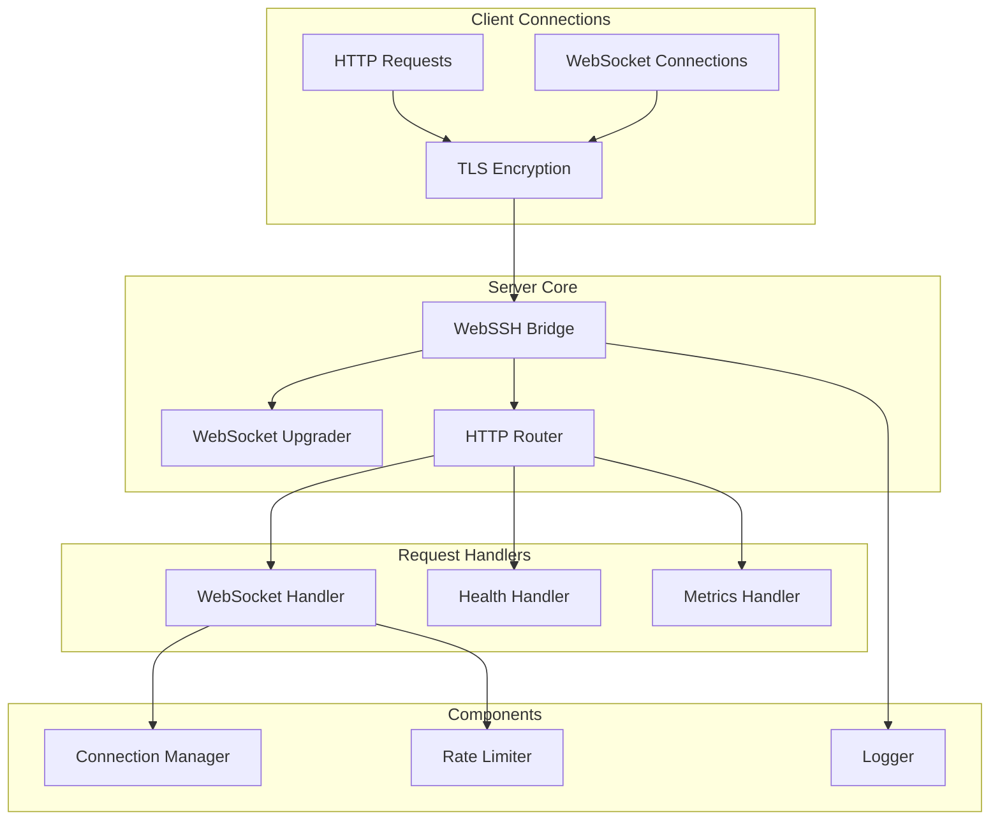
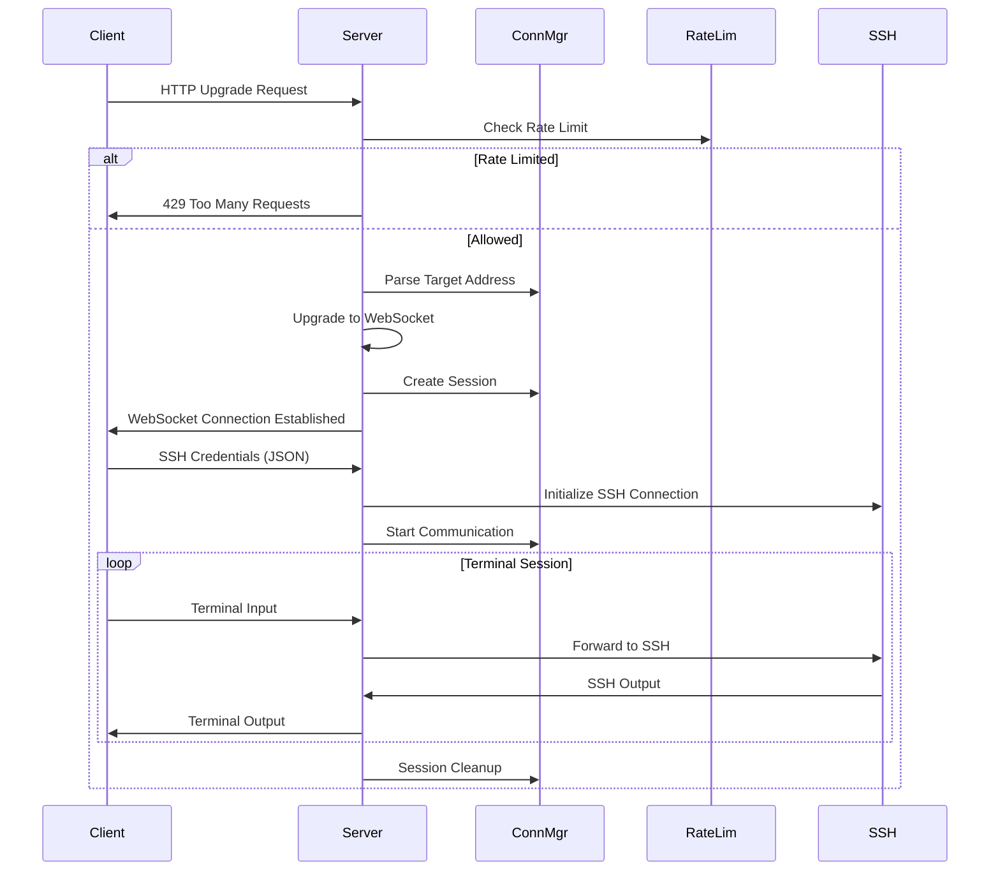

# HTTP/WebSocket Server

This package implements the core HTTP/WebSocket server functionality for Ubyte WebSSH Bridge, handling TLS termination, WebSocket upgrades, and request routing.

## 🏗️ Architecture



## 🔧 Core Components

### WebSSH Bridge Server

The main server struct that orchestrates all components:

```go
type WebSSHBridge struct {
    config            *config.Configuration
    logger            *logrus.Logger
    connectionManager *connection.ConnectionManager
    rateLimiter       *utils.RateLimiter
    httpServer        *http.Server
    websocketUpgrader websocket.Upgrader
}
```

### WebSocket Upgrader Configuration

```go
upgrader := websocket.Upgrader{
    ReadBufferSize:   cfg.WebSocketReadBufferSize,   // Default: 8KB
    WriteBufferSize:  cfg.WebSocketWriteBufferSize,  // Default: 8KB
    HandshakeTimeout: cfg.WebSocketHandshakeTimeout, // Default: 30s
    CheckOrigin:      server.checkOrigin,
}
```

## 🔌 Request Handling

### WebSocket Connection Flow



### URL Pattern Parsing

The server expects WebSocket connections in the format:

```
/ws/{ssh_host}/{ssh_port}
```

Example URL parsing:

```go
func (manager *ConnectionManager) ParseTargetAddress(request *http.Request) (string, error) {
    pathParts := strings.Split(request.URL.Path, "/")
    if len(pathParts) < 4 {
        return "", fmt.Errorf("URL does not contain valid host and port")
    }
    return pathParts[2] + ":" + pathParts[3], nil
}
```

## 🛠️ Server Lifecycle

### Server Initialization

```go
// Create new WebSSH bridge
bridge, err := server.NewWebSSHBridge(cfg)
if err != nil {
    log.Fatalf("Failed to create WebSSH bridge: %v", err)
}

// Run the server (blocks until shutdown)
if err := bridge.Run(); err != nil {
    log.Fatalf("Server error: %v", err)
}
```

### Graceful Shutdown

The server implements graceful shutdown with signal handling:

```go
func (bridge *WebSSHBridge) Run() error {
    // Setup signal handling
    signalChannel := make(chan os.Signal, 1)
    signal.Notify(signalChannel, syscall.SIGINT, syscall.SIGTERM)

    // Start server in goroutine
    serverError := make(chan error, 1)
    go func() {
        serverError <- bridge.Start()
    }()

    // Wait for shutdown signal or server error
    select {
    case err := <-serverError:
        return err
    case sig := <-signalChannel:
        bridge.logger.Infof("Received signal %v, initiating graceful shutdown", sig)
        return bridge.Stop()
    }
}
```

### Shutdown Process

```go
func (bridge *WebSSHBridge) Stop() error {
    // Create shutdown context with timeout
    ctx, cancel := context.WithTimeout(context.Background(), bridge.config.ShutdownTimeout)
    defer cancel()

    // Shutdown HTTP server
    if err := bridge.httpServer.Shutdown(ctx); err != nil {
        bridge.logger.Errorf("HTTP server shutdown error: %v", err)
    }

    // Shutdown connection manager
    if err := bridge.connectionManager.Shutdown(); err != nil {
        bridge.logger.Errorf("Connection manager shutdown error: %v", err)
    }

    // Close rate limiter
    bridge.rateLimiter.Close()

    return nil
}
```

## 🔍 Monitoring Endpoints

### Health Check Endpoint

```
GET /health
```

Implementation:

```go
func (bridge *WebSSHBridge) handleHealthCheck(w http.ResponseWriter, r *http.Request) {
    stats := bridge.connectionManager.GetStats()

    health := map[string]interface{}{
        "status":          "healthy",
        "timestamp":       time.Now().UTC(),
        "active_sessions": stats["active_sessions"],
        "total_sessions":  stats["total_sessions"],
        "uptime":          "unknown", // Could be implemented if needed
    }

    w.Header().Set("Content-Type", "application/json")
    json.NewEncoder(w).Encode(health)
}
```

### Metrics Endpoint

```
GET /metrics
```

Implementation:

```go
func (bridge *WebSSHBridge) handleMetrics(w http.ResponseWriter, r *http.Request) {
    connectionStats := bridge.connectionManager.GetStats()
    rateLimiterStats := bridge.rateLimiter.GetStats()

    metrics := map[string]interface{}{
        "connections":  connectionStats,
        "limiter":      rateLimiterStats,
        "timestamp":    time.Now().UTC(),
    }

    w.Header().Set("Content-Type", "application/json")
    json.NewEncoder(w).Encode(metrics)
}
```

## 🔒 Security Features

### TLS Configuration

The server requires TLS for all connections and uses a secure-by-default configuration:

```go
bridge.httpServer = &http.Server{
    Addr:      bridge.config.ListenAddress,
    Handler:   mux,
    TLSConfig: config.SecureTLSConfig(),
}

// Start server with TLS
if err := bridge.httpServer.ListenAndServeTLS(
    bridge.config.CertificateFile,
    bridge.config.KeyFile,
); err != nil && err != http.ErrServerClosed {
    return fmt.Errorf("server failed to start: %v", err)
}
```

### Dynamic Origin Check

The server provides automatic Cross-Site WebSocket Hijacking (CSWH) protection by validating the `Origin` header against the `Host` header:

```go
func (bridge *WebSSHBridge) checkOrigin(r *http.Request) bool {
	origin := r.Header.Get("Origin")
	if origin == "" {
		return true // Allow non-browser clients
	}
	host := r.Host
	if origin != "https://"+host && origin != "http://"+host {
		bridge.logger.Warnf("WebSocket connection from untrusted origin %s blocked (host: %s)", origin, host)
		return false
	}
	return true
}
```

### Rate Limiting Integration

```go
// Check rate limiting before processing
clientIP := bridge.connectionManager.GetClientIP(request)
if !bridge.rateLimiter.IsAllowed(clientIP) {
    http.Error(responseWriter, "Rate limit exceeded. Please wait before trying again", http.StatusTooManyRequests)
    bridge.logger.Warnf("Rate limit exceeded for IP %s", clientIP)
    return
}
```

### Client IP Detection

The server detects client IPs through multiple headers:

```go
func (manager *ConnectionManager) GetClientIP(request *http.Request) string {
    // Check X-Forwarded-For header first
    if xff := request.Header.Get("X-Forwarded-For"); xff != "" {
        if ips := strings.Split(xff, ","); len(ips) > 0 {
            return strings.TrimSpace(ips[0])
        }
    }

    // Check X-Real-IP header
    if xri := request.Header.Get("X-Real-IP"); xri != "" {
        return xri
    }

    // Fall back to RemoteAddr
    if host, _, err := net.SplitHostPort(request.RemoteAddr); err == nil {
        return host
    }

    return request.RemoteAddr
}
```

## ⚡ Performance Optimization

### WebSocket Buffer Configuration

```go
// High-performance settings
upgrader := websocket.Upgrader{
    ReadBufferSize:   32768,  // 32KB for high throughput
    WriteBufferSize:  32768,  // 32KB for high throughput
    HandshakeTimeout: 10 * time.Second,  // Fast handshake
}
```

### Connection Limits

```go
// Production connection limits
cfg.MaxConnections = 10000        // Global limit
cfg.MaxConnectionsPerHost = 100   // Per-host limit
cfg.ConnectionTimeout = 60 * time.Second  // Connection timeout
```

### HTTP Server Tuning

```go
bridge.httpServer = &http.Server{
    Addr:           bridge.config.ListenAddress,
    Handler:        mux,
    ReadTimeout:    30 * time.Second,
    WriteTimeout:   30 * time.Second,
    IdleTimeout:    120 * time.Second,
    MaxHeaderBytes: 1 << 20, // 1MB
}
```

## 🐛 Error Handling

### WebSocket Error Handling

```go
func (bridge *WebSSHBridge) handleWebSocketError(webSocketConn *websocket.Conn, errorMessage string, err error) {
    if closeErr := webSocketConn.Close(); closeErr != nil {
        bridge.logger.Errorf("Failed to close WebSocket after error: %v", closeErr)
    }
    bridge.logger.Errorf("%s: %v", errorMessage, err)
}
```

### Connection Error Recovery

```go
// Handle session creation errors
session, err := bridge.connectionManager.CreateSession(webSocketConn, targetAddress, clientIP)
if err != nil {
    bridge.handleWebSocketError(webSocketConn, "Failed to create session", err)
    return
}

// Handle SSH initialization errors
if err := bridge.connectionManager.InitializeSession(session, credentials); err != nil {
    bridge.handleWebSocketError(webSocketConn, "Failed to initialize SSH connection", err)
    return
}
```

## 🧪 Testing

### Unit Testing

```go
func TestWebSSHBridge_NewWebSSHBridge(t *testing.T) {
    cfg := config.DefaultConfiguration()

    bridge, err := server.NewWebSSHBridge(cfg)
    assert.NoError(t, err)
    assert.NotNil(t, bridge)
    assert.Equal(t, cfg, bridge.config)
}

func TestWebSSHBridge_InvalidConfig(t *testing.T) {
    cfg := &config.Configuration{
        ListenAddress: "", // Invalid empty address
    }

    bridge, err := server.NewWebSSHBridge(cfg)
    assert.Error(t, err)
    assert.Nil(t, bridge)
}
```

### Integration Testing

```go
func TestWebSSHBridge_HealthEndpoint(t *testing.T) {
    cfg := config.DefaultConfiguration()
    cfg.ListenAddress = ":0" // Random port

    bridge, err := server.NewWebSSHBridge(cfg)
    require.NoError(t, err)

    // Start server in background
    go func() {
        bridge.Start()
    }()

    // Test health endpoint
    resp, err := http.Get("https://localhost" + bridge.httpServer.Addr + "/health")
    require.NoError(t, err)
    assert.Equal(t, http.StatusOK, resp.StatusCode)
}
```

## 📊 Monitoring and Logging

### Structured Logging

```go
// Server startup logging
bridge.logger.Infof("Starting WebSSH Bridge server on %s", bridge.config.ListenAddress)

// WebSocket connection logging
bridge.logger.Infof("WebSocket session %s established: %s -> %s",
    session.ID, clientIP, targetAddress)

// Rate limiting logging
bridge.logger.Warnf("Rate limit exceeded for IP %s connecting to %s",
    clientIP, targetAddress)

// Shutdown logging
bridge.logger.Info("WebSSH Bridge server shutdown complete")
```

### Metrics Collection

The server collects these key metrics:

- Active WebSocket sessions
- Total sessions handled
- Successful vs failed connections
- Rate limiting incidents
- Connection duration statistics
- Error rates by type

## 📖 Configuration Examples

### Development Configuration

```go
cfg := config.DefaultConfiguration()
cfg.ListenAddress = ":8080"
cfg.DebugMode = true
cfg.CertificateFile = "dev.crt"
cfg.KeyFile = "dev.key"
```

### Production Configuration

```go
cfg := &config.Configuration{
    ListenAddress:   ":443",
    CertificateFile: "/etc/ssl/certs/server.crt",
    KeyFile:         "/etc/ssl/private/server.key",
    DebugMode:       false,
    MaxConnections:  10000,
    EnableHealthCheck: true,
    EnableMetrics:     true,
}
```

### Load Balancer Configuration

```go
cfg := config.DefaultConfiguration()
cfg.ListenAddress = ":8443"
cfg.EnableHealthCheck = true
cfg.HealthCheckPath = "/health"
// Health checks from load balancer don't count against rate limits
cfg.RateLimitWhitelist = []string{"10.0.0.0/8"} // Internal LB network
```

## 📖 Related Documentation

- [Configuration Management](../config/README.md) - Server configuration options
- [Connection Management](../connection/README.md) - Session handling
- [Message Processing](../message/README.md) - WebSocket message handling
- [Rate Limiting](../utils/README.md) - Rate limiting implementation
- [Frontend Interface](../../frontend/README.md) - Web client documentation
