# SSH Client Module

[](https://golang.org)
[]()

Advanced SSH client wrapper with enterprise-grade features including RADIUS authentication support, comprehensive timeout management, and robust session handling.

## 🏗️ Architecture Overview

```mermaid
graph TB
    subgraph "SSH Client Layer"
        Client["🔧 SSHClient"]
        Session["📟 SSHSession"]
        Config["⚙️ ClientConfig"]
    end

    subgraph "Connection Management"
        Timeouts["⏰ Timeout Manager"]
        Dialer["🌐 Network Dialer"]
        Handshake["🤝 SSH Handshake"]
    end

    subgraph "Session Control"
        PTY["📺 PTY Terminal"]
        Pipes["🔄 I/O Pipes"]
        WindowMgr["📏 Window Manager"]
    end

    subgraph "Security Layer"
        Ciphers["🔐 Cipher Suites"]
        KeyExchange["🔑 Key Exchange"]
        Auth["🛡️ Authentication"]
    end

    Client --> Config
    Client --> Session
    Config --> Timeouts
    Config --> Auth
    Session --> PTY
    Session --> Pipes
    Session --> WindowMgr
    Timeouts --> Dialer
    Dialer --> Handshake
    Handshake --> Ciphers
    Handshake --> KeyExchange
```



## ✨ Key Features

- **🔐 Enterprise Security**: Modern cipher suites, secure key exchange algorithms
- **⏰ Advanced Timeouts**: Granular timeout control for connection, auth, and handshake
- **🛡️ RADIUS Support**: Extended timeout handling for RADIUS authentication
- **📺 PTY Management**: Full pseudo-terminal support with window resizing
- **🔄 I/O Streaming**: Efficient stdin/stdout pipe management
- **📊 Connection Monitoring**: Detailed logging and connection state tracking
- **🔧 Error Recovery**: Robust error handling with automatic cleanup

## 🔧 Core Components

### SSHClient

The main SSH client wrapper that manages connections and provides enhanced functionality.

```go
type SSHClient struct {
    client    *ssh.Client
    config    *ssh.ClientConfig
    address   string
    logger    *logrus.Logger
    connected bool
}
```

**Key Methods:**

- `NewSSHClient()` - Creates configured SSH client
- `Connect()` - Establishes connection with timeout control
- `NewSession()` - Creates new SSH session with PTY
- `IsConnected()` - Checks connection status
- `Close()` - Cleanly closes SSH connection

### SSHSession

Represents an active SSH session with I/O pipe management.

```go
type SSHSession struct {
    session    *ssh.Session
    stdinPipe  io.WriteCloser
    stdoutPipe io.Reader
    client     *SSHClient
}
```

**Key Methods:**

- `StartShell()` - Starts interactive shell
- `WindowChange()` - Handles terminal resize events
- `Wait()` - Waits for session completion
- `GetStdinPipe()` - Returns stdin writer
- `GetStdoutPipe()` - Returns stdout reader
- `Close()` - Closes session and cleanup

## ⚙️ Configuration

### SSH Timeouts

```go
type SSHTimeouts struct {
    ConnectTimeout   time.Duration  // TCP connection timeout
    AuthTimeout      time.Duration  // SSH authentication timeout
    HandshakeTimeout time.Duration  // Complete SSH handshake timeout
}
```

### Supported Cipher Suites

```go
Ciphers: []string{
    "aes128-cbc", "aes192-cbc", "aes256-cbc",           // CBC modes
    "aes128-ctr", "aes192-ctr", "aes256-ctr",           // CTR modes
    "aes128-gcm@openssh.com", "aes256-gcm@openssh.com", // GCM modes
    "chacha20-poly1305@openssh.com",                     // ChaCha20
    "3des-cbc",                                          // Legacy support
}
```

### Key Exchange Algorithms

```go
KeyExchanges: []string{
    "curve25519-sha256", "curve25519-sha256@libssh.org", // Modern curves
    "ecdh-sha2-nistp256", "ecdh-sha2-nistp384", "ecdh-sha2-nistp521", // NIST curves
    "diffie-hellman-group14-sha256", "diffie-hellman-group16-sha512",  // DH groups
    "diffie-hellman-group-exchange-sha256",               // DH exchange
}
```

## 🚀 Usage Examples

### Basic SSH Connection

```go
package main

import (
    "context"
    "time"
    "github.com/ubyte-source/ubyte-webssh-bridge/ssh"
    "github.com/ubyte-source/ubyte-webssh-bridge/message"
)

func main() {
    // Configure timeouts
    timeouts := ssh.SSHTimeouts{
        ConnectTimeout:   10 * time.Second,
        AuthTimeout:      30 * time.Second,  // Extended for RADIUS
        HandshakeTimeout: 45 * time.Second,
    }

    // Create credentials
    credentials := message.Credentials{
        Username: "user",
        Password: "password",
    }

    // Create SSH client
    client := ssh.NewSSHClient(credentials, "192.168.1.100:22", timeouts, logger)

    // Connect
    ctx := context.Background()
    if err := client.Connect(ctx, timeouts); err != nil {
        log.Fatalf("Connection failed: %v", err)
    }
    defer client.Close()

    // Create session
    session, err := client.NewSession()
    if err != nil {
        log.Fatalf("Session creation failed: %v", err)
    }
    defer session.Close()

    // Start shell
    if err := session.StartShell(); err != nil {
        log.Fatalf("Shell start failed: %v", err)
    }

    // Wait for completion
    session.Wait()
}
```

### Advanced Session with I/O Handling

```go
func handleSSHSession(session *ssh.SSHSession) {
    // Get I/O pipes
    stdin := session.GetStdinPipe()
    stdout := session.GetStdoutPipe()

    // Start shell
    if err := session.StartShell(); err != nil {
        log.Fatalf("Shell start failed: %v", err)
    }

    // Handle input
    go func() {
        defer stdin.Close()
        scanner := bufio.NewScanner(os.Stdin)
        for scanner.Scan() {
            line := scanner.Text() + "\n"
            if _, err := stdin.Write([]byte(line)); err != nil {
                log.Printf("Write error: %v", err)
                return
            }
        }
    }()

    // Handle output
    go func() {
        buffer := make([]byte, 8192)
        for {
            n, err := stdout.Read(buffer)
            if n > 0 {
                os.Stdout.Write(buffer[:n])
            }
            if err != nil {
                if err != io.EOF {
                    log.Printf("Read error: %v", err)
                }
                return
            }
        }
    }()

    // Wait for session completion
    session.Wait()
}
```

### Terminal Resize Handling

```go
func handleTerminalResize(session *ssh.SSHSession, rows, cols int) error {
    // Validate dimensions
    if rows <= 0 || cols <= 0 {
        return fmt.Errorf("invalid dimensions: rows=%d, cols=%d", rows, cols)
    }

    // Apply resize
    if err := session.WindowChange(rows, cols); err != nil {
        return fmt.Errorf("window change failed: %v", err)
    }

    log.Printf("Terminal resized to %dx%d", cols, rows)
    return nil
}
```

## 🔍 Timeout Configuration

### Standard Configuration

```go
timeouts := ssh.SSHTimeouts{
    ConnectTimeout:   5 * time.Second,   // TCP connection
    AuthTimeout:      10 * time.Second,  // Standard auth
    HandshakeTimeout: 15 * time.Second,  // Complete handshake
}
```

### RADIUS Authentication Configuration

```go
// Extended timeouts for RADIUS authentication
timeouts := ssh.SSHTimeouts{
    ConnectTimeout:   10 * time.Second,  // Network latency
    AuthTimeout:      30 * time.Second,  // RADIUS server delay
    HandshakeTimeout: 45 * time.Second,  // Total handshake time
}
```

### High-Latency Network Configuration

```go
// Configuration for satellite or high-latency connections
timeouts := ssh.SSHTimeouts{
    ConnectTimeout:   30 * time.Second,  // High network latency
    AuthTimeout:      60 * time.Second,  // Extended auth time
    HandshakeTimeout: 90 * time.Second,  // Complete handshake
}
```

## 🔐 Security Best Practices

### 1. Cipher Suite Selection

The module automatically selects secure cipher suites in priority order:

- **ChaCha20-Poly1305** - Modern AEAD cipher
- **AES-GCM** - Hardware-accelerated AEAD
- **AES-CTR** - Counter mode for performance
- **AES-CBC** - Compatibility mode

### 2. Key Exchange Security

Prioritizes modern key exchange algorithms:

- **Curve25519** - Modern elliptic curve
- **NIST P-curves** - Standards compliance
- **DH Group 14+** - Strong Diffie-Hellman

### 3. Host Key Verification

⚠️ **Security Note**: Current implementation uses `ssh.InsecureIgnoreHostKey()` for flexibility. In production:

```go
// Implement proper host key verification
config.HostKeyCallback = func(hostname string, remote net.Addr, key ssh.PublicKey) error {
    // Implement your host key verification logic
    return verifyHostKey(hostname, key)
}
```

## 📊 Performance Tuning

### Connection Pooling

```go
type SSHPool struct {
    clients map[string]*ssh.SSHClient
    mutex   sync.RWMutex
}

func (pool *SSHPool) GetClient(address string) *ssh.SSHClient {
    pool.mutex.RLock()
    client, exists := pool.clients[address]
    pool.mutex.RUnlock()

    if exists && client.IsConnected() {
        return client
    }

    // Create new client if needed
    pool.mutex.Lock()
    defer pool.mutex.Unlock()

    // Double-check after acquiring write lock
    if client, exists := pool.clients[address]; exists && client.IsConnected() {
        return client
    }

    // Create new client
    newClient := ssh.NewSSHClient(credentials, address, timeouts, logger)
    pool.clients[address] = newClient
    return newClient
}
```

### Buffer Size Optimization

```go
// Optimal buffer sizes for different scenarios
const (
    SmallBuffer  = 4096   // Low-latency interactive
    MediumBuffer = 8192   // Standard terminal usage
    LargeBuffer  = 16384  // File transfers/bulk data
)
```

## 🐛 Troubleshooting

### Common Connection Issues

#### 1. Connection Timeout

```
Error: TCP connection failed: dial tcp: i/o timeout
```

**Solutions:**

- Increase `ConnectTimeout`
- Check network connectivity
- Verify SSH server is running
- Check firewall rules

#### 2. Authentication Timeout

```
Error: SSH handshake failed: ssh: handshake failed: timeout
```

**Solutions:**

- Increase `AuthTimeout` (especially for RADIUS)
- Verify credentials
- Check SSH server auth methods
- Monitor RADIUS server response times

#### 3. PTY Request Failed

```
Error: failed to request PTY: ssh: pty request failed
```

**Solutions:**

- Check SSH server PTY allocation limits
- Verify user has shell access
- Check SSH server configuration (`PermitTTY`)

### Logging and Diagnostics

```go
// Enable detailed SSH logging
import "log"

// Create logger with debug level
logger := logrus.New()
logger.SetLevel(logrus.DebugLevel)

// SSH client will provide detailed connection logs
client := ssh.NewSSHClient(credentials, address, timeouts, logger)
```

### Connection State Monitoring

```go
func monitorConnection(client *ssh.SSHClient) {
    ticker := time.NewTicker(30 * time.Second)
    defer ticker.Stop()

    for range ticker.C {
        if !client.IsConnected() {
            log.Println("SSH connection lost, attempting reconnect...")
            if err := client.Connect(context.Background(), timeouts); err != nil {
                log.Printf("Reconnection failed: %v", err)
            } else {
                log.Println("SSH connection restored")
            }
        }
    }
}
```

## 🧪 Testing

### Unit Tests

```go
func TestSSHClientConnection(t *testing.T) {
    client := ssh.NewSSHClient(testCredentials, testAddress, testTimeouts, nil)

    ctx, cancel := context.WithTimeout(context.Background(), 30*time.Second)
    defer cancel()

    err := client.Connect(ctx, testTimeouts)
    if err != nil {
        t.Fatalf("Connection failed: %v", err)
    }

    if !client.IsConnected() {
        t.Fatal("Client should be connected")
    }

    defer client.Close()
}
```

### Integration Tests

```go
func TestSSHSessionInteraction(t *testing.T) {
    // Setup client and session
    client := setupTestClient(t)
    session, err := client.NewSession()
    if err != nil {
        t.Fatalf("Session creation failed: %v", err)
    }
    defer session.Close()

    // Test shell interaction
    if err := session.StartShell(); err != nil {
        t.Fatalf("Shell start failed: %v", err)
    }

    // Test command execution
    testCommand := "echo 'test'\n"
    stdin := session.GetStdinPipe()
    if _, err := stdin.Write([]byte(testCommand)); err != nil {
        t.Fatalf("Command write failed: %v", err)
    }

    // Verify output
    stdout := session.GetStdoutPipe()
    buffer := make([]byte, 1024)
    n, err := stdout.Read(buffer)
    if err != nil && err != io.EOF {
        t.Fatalf("Output read failed: %v", err)
    }

    output := string(buffer[:n])
    if !strings.Contains(output, "test") {
        t.Fatalf("Expected 'test' in output, got: %s", output)
    }
}
```

## 📈 Metrics and Monitoring

### Connection Metrics

```go
type SSHMetrics struct {
    ConnectionAttempts  int64
    SuccessfulConnections int64
    FailedConnections   int64
    ActiveSessions      int64
    AverageConnectTime  time.Duration
}

func (m *SSHMetrics) RecordConnection(duration time.Duration, success bool) {
    atomic.AddInt64(&m.ConnectionAttempts, 1)
    if success {
        atomic.AddInt64(&m.SuccessfulConnections, 1)
    } else {
        atomic.AddInt64(&m.FailedConnections, 1)
    }
    // Update average connection time
    m.updateAverageConnectTime(duration)
}
```

### Health Checks

```go
func (client *SSHClient) HealthCheck() error {
    if !client.IsConnected() {
        return fmt.Errorf("SSH client not connected")
    }

    // Optionally test with a simple command
    session, err := client.NewSession()
    if err != nil {
        return fmt.Errorf("session creation failed: %v", err)
    }
    defer session.Close()

    // Test basic connectivity
    if err := session.StartShell(); err != nil {
        return fmt.Errorf("shell start failed: %v", err)
    }

    return nil
}
```

---

## 🔗 Related Documentation

- [📖 Connection Management](../connection/) - Session and connection lifecycle
- [📖 Message Processing](../message/) - WebSocket message handling
- [📖 Configuration](../config/) - System configuration options
- [📖 Server](../server/) - HTTP/WebSocket server setup

## 📋 API Reference

For complete API documentation, see the generated Go docs:

```bash
go doc github.com/ubyte-source/ubyte-webssh-bridge/ssh
```
