# Utils Module

[](https://golang.org)
[]()

Comprehensive utilities module providing advanced rate limiting, IP management, and system utilities for enterprise-grade WebSocket-SSH bridge deployments.

## 🏗️ Architecture Overview

```mermaid
graph TB
    subgraph "Rate Limiting Engine"
        RateLimiter["⏱️ RateLimiter"]
        TokenBucket["🪣 Token Bucket"]
        Whitelist["📋 IP Whitelist"]
    end

    subgraph "Memory Management"
        Cleanup["🧹 Cleanup Goroutine"]
        Expiry["⏰ Entry Expiration"]
        GC["♻️ Memory Optimization"]
    end

    subgraph "Monitoring & Stats"
        Metrics["📊 Live Metrics"]
        Counters["🔢 Attempt Counters"]
        Timestamps["📅 Last Attempt Tracking"]
    end

    subgraph "Thread Safety"
        RWMutex["🔒 RWMutex"]
        Concurrent["🔄 Concurrent Access"]
        AtomicOps["⚡ Atomic Operations"]
    end

    RateLimiter --> TokenBucket
    RateLimiter --> Whitelist
    TokenBucket --> Cleanup
    Cleanup --> Expiry
    Expiry --> GC
    RateLimiter --> Metrics
    Metrics --> Counters
    Counters --> Timestamps
    RateLimiter --> RWMutex
    RWMutex --> Concurrent
    Concurrent --> AtomicOps
```



## ✨ Key Features

- **⏱️ Token Bucket Algorithm**: Precise rate limiting with burst control
- **📋 IP Whitelisting**: Exempt trusted IPs from rate limiting
- **🧹 Automatic Cleanup**: Memory-efficient with automatic expiration
- **📊 Real-time Metrics**: Live statistics and monitoring
- **🔒 Thread-Safe**: Concurrent access with RWMutex protection
- **⚡ High Performance**: Optimized for minimal latency impact
- **♻️ Memory Efficient**: Automatic cleanup prevents memory leaks

## 🔧 Core Components

### RateLimiter

The main rate limiting engine implementing a token bucket algorithm with IP-based tracking.

```go
type RateLimiter struct {
    interval        time.Duration          // Rate limiting interval
    burst           int                    // Maximum burst size
    perIP           bool                   // Enable per-IP limiting
    whitelist       map[string]bool        // Whitelisted IP addresses
    lastAttempts    map[string]time.Time   // Last attempt timestamps
    attemptCounts   map[string]int         // Current attempt counts
    mutex           sync.RWMutex           // Thread safety
    cleanupInterval time.Duration          // Cleanup frequency
    stopCleanup     chan struct{}          // Cleanup termination
}
```

**Key Methods:**

- `NewRateLimiter()` - Creates new rate limiter instance
- `IsAllowed()` - Checks if request is allowed
- `RecordAttempt()` - Records an attempt for tracking
- `GetStats()` - Returns current statistics
- `Close()` - Stops cleanup and releases resources

## ⚙️ Configuration

### Basic Rate Limiter Setup

```go
import (
    "time"
    "github.com/ubyte-source/ubyte-webssh-bridge/utils"
)

// Create rate limiter with 10 requests per minute, burst of 5
rateLimiter := utils.NewRateLimiter(
    time.Minute,        // interval: 1 minute
    5,                  // burst: 5 requests
    true,               // perIP: enable per-IP limiting
    []string{           // whitelist: trusted IPs
        "127.0.0.1",
        "10.0.0.1",
        "192.168.1.100",
    },
)
defer rateLimiter.Close()
```

### Production Configuration Examples

#### High-Traffic Web Service

```go
// Configuration for high-traffic scenarios
rateLimiter := utils.NewRateLimiter(
    5*time.Second,      // 5-second intervals
    20,                 // 20 requests burst
    true,               // per-IP limiting
    []string{           // Load balancer IPs
        "10.0.1.1",
        "10.0.1.2",
        "172.16.0.1",
    },
)
```

#### Security-Focused Deployment

```go
// Strict rate limiting for security
rateLimiter := utils.NewRateLimiter(
    30*time.Second,     // 30-second intervals
    3,                  // Only 3 requests burst
    true,               // per-IP limiting
    []string{           // Only monitoring systems
        "192.168.100.10", // Monitoring server
    },
)
```

#### Development Environment

```go
// Relaxed limits for development
rateLimiter := utils.NewRateLimiter(
    time.Second,        // 1-second intervals
    50,                 // High burst limit
    true,               // per-IP limiting
    []string{           // Development networks
        "127.0.0.1",
        "::1",
        "192.168.0.0/16",
    },
)
```

## 🚀 Usage Examples

### Basic Rate Limiting

```go
package main

import (
    "fmt"
    "time"
    "github.com/ubyte-source/ubyte-webssh-bridge/utils"
)

func main() {
    // Create rate limiter: 10 requests per minute, burst of 3
    rl := utils.NewRateLimiter(time.Minute, 3, true, nil)
    defer rl.Close()

    clientIP := "192.168.1.100"

    // Test rate limiting
    for i := 0; i < 5; i++ {
        if rl.IsAllowed(clientIP) {
            fmt.Printf("Request %d: ALLOWED\n", i+1)
        } else {
            fmt.Printf("Request %d: RATE LIMITED\n", i+1)
        }
    }

    // Wait for interval reset
    time.Sleep(time.Minute + time.Second)

    // Should be allowed again
    if rl.IsAllowed(clientIP) {
        fmt.Println("After interval: ALLOWED")
    }
}
```

### HTTP Middleware Integration

```go
func RateLimitMiddleware(rateLimiter *utils.RateLimiter) func(http.Handler) http.Handler {
    return func(next http.Handler) http.Handler {
        return http.HandlerFunc(func(w http.ResponseWriter, r *http.Request) {
            // Get client IP
            clientIP := getClientIP(r)

            // Check rate limit
            if !rateLimiter.IsAllowed(clientIP) {
                http.Error(w, "Rate limit exceeded", http.StatusTooManyRequests)

                // Log rate limit violation
                log.Printf("Rate limit exceeded for IP: %s", clientIP)
                return
            }

            // Continue to next handler
            next.ServeHTTP(w, r)
        })
    }
}

func getClientIP(r *http.Request) string {
    // Check X-Forwarded-For header
    if xff := r.Header.Get("X-Forwarded-For"); xff != "" {
        // Take first IP from comma-separated list
        if ips := strings.Split(xff, ","); len(ips) > 0 {
            return strings.TrimSpace(ips[0])
        }
    }

    // Check X-Real-IP header
    if xri := r.Header.Get("X-Real-IP"); xri != "" {
        return xri
    }

    // Fallback to RemoteAddr
    host, _, err := net.SplitHostPort(r.RemoteAddr)
    if err != nil {
        return r.RemoteAddr
    }
    return host
}
```

### WebSocket Rate Limiting

```go
func handleWebSocketConnection(w http.ResponseWriter, r *http.Request, rateLimiter *utils.RateLimiter) {
    // Get client IP
    clientIP := getClientIP(r)

    // Check rate limit before upgrade
    if !rateLimiter.IsAllowed(clientIP) {
        http.Error(w, "Rate limit exceeded. Please wait before reconnecting", http.StatusTooManyRequests)
        log.Printf("WebSocket rate limit exceeded for IP: %s", clientIP)
        return
    }

    // Upgrade to WebSocket
    upgrader := websocket.Upgrader{
        CheckOrigin: func(r *http.Request) bool { return true },
    }

    conn, err := upgrader.Upgrade(w, r, nil)
    if err != nil {
        log.Printf("WebSocket upgrade failed: %v", err)
        return
    }
    defer conn.Close()

    // Handle WebSocket communication
    handleWebSocketMessages(conn, clientIP, rateLimiter)
}

func handleWebSocketMessages(conn *websocket.Conn, clientIP string, rateLimiter *utils.RateLimiter) {
    for {
        // Read message
        messageType, message, err := conn.ReadMessage()
        if err != nil {
            log.Printf("WebSocket read error: %v", err)
            break
        }

        // Rate limit individual messages
        if !rateLimiter.IsAllowed(clientIP) {
            // Send rate limit error
            errorMsg := map[string]string{
                "error": "Rate limit exceeded",
                "code":  "RATE_LIMITED",
            }
            conn.WriteJSON(errorMsg)
            continue
        }

        // Process message
        processWebSocketMessage(conn, messageType, message)
    }
}
```

### Advanced Whitelist Management

```go
type DynamicRateLimiter struct {
    *utils.RateLimiter
    whitelist map[string]bool
    mutex     sync.RWMutex
}

func NewDynamicRateLimiter(interval time.Duration, burst int) *DynamicRateLimiter {
    return &DynamicRateLimiter{
        RateLimiter: utils.NewRateLimiter(interval, burst, true, nil),
        whitelist:   make(map[string]bool),
    }
}

func (drl *DynamicRateLimiter) AddToWhitelist(ip string) {
    drl.mutex.Lock()
    defer drl.mutex.Unlock()
    drl.whitelist[ip] = true
    log.Printf("Added IP to whitelist: %s", ip)
}

func (drl *DynamicRateLimiter) RemoveFromWhitelist(ip string) {
    drl.mutex.Lock()
    defer drl.mutex.Unlock()
    delete(drl.whitelist, ip)
    log.Printf("Removed IP from whitelist: %s", ip)
}

func (drl *DynamicRateLimiter) IsWhitelisted(ip string) bool {
    drl.mutex.RLock()
    defer drl.mutex.RUnlock()
    return drl.whitelist[ip]
}

func (drl *DynamicRateLimiter) IsAllowed(ip string) bool {
    // Check dynamic whitelist first
    if drl.IsWhitelisted(ip) {
        return true
    }

    // Fall back to regular rate limiting
    return drl.RateLimiter.IsAllowed(ip)
}
```

## 📊 Monitoring and Metrics

### Real-time Statistics

```go
func monitorRateLimiter(rateLimiter *utils.RateLimiter) {
    ticker := time.NewTicker(30 * time.Second)
    defer ticker.Stop()

    for range ticker.C {
        stats := rateLimiter.GetStats()

        log.Printf("Rate Limiter Stats:")
        log.Printf("  Active limiters: %v", stats["active_limiters"])
        log.Printf("  Interval: %v", stats["interval"])
        log.Printf("  Burst limit: %v", stats["burst"])
        log.Printf("  Per-IP enabled: %v", stats["per_ip"])
        log.Printf("  Whitelist size: %v", stats["whitelist_size"])
    }
}
```

### Metrics Export for Prometheus

```go
import (
    "github.com/prometheus/client_golang/prometheus"
    "github.com/prometheus/client_golang/prometheus/promauto"
)

var (
    rateLimitedRequests = promauto.NewCounterVec(
        prometheus.CounterOpts{
            Name: "rate_limited_requests_total",
            Help: "Total number of rate limited requests",
        },
        []string{"client_ip"},
    )

    allowedRequests = promauto.NewCounterVec(
        prometheus.CounterOpts{
            Name: "allowed_requests_total",
            Help: "Total number of allowed requests",
        },
        []string{"client_ip"},
    )

    activeLimiters = promauto.NewGauge(
        prometheus.GaugeOpts{
            Name: "active_rate_limiters",
            Help: "Number of active rate limiters",
        },
    )
)

func (rl *RateLimiter) IsAllowedWithMetrics(identifier string) bool {
    allowed := rl.IsAllowed(identifier)

    if allowed {
        allowedRequests.WithLabelValues(identifier).Inc()
    } else {
        rateLimitedRequests.WithLabelValues(identifier).Inc()
    }

    // Update active limiters gauge
    stats := rl.GetStats()
    if count, ok := stats["active_limiters"].(int); ok {
        activeLimiters.Set(float64(count))
    }

    return allowed
}
```

### Health Check Integration

```go
func (rl *RateLimiter) HealthCheck() error {
    stats := rl.GetStats()

    activeLimiters, ok := stats["active_limiters"].(int)
    if !ok {
        return fmt.Errorf("invalid active limiters type")
    }

    // Check for potential memory leak
    if activeLimiters > 10000 {
        return fmt.Errorf("too many active limiters: %d", activeLimiters)
    }

    // Verify cleanup is working
    whitelistSize, ok := stats["whitelist_size"].(int)
    if !ok {
        return fmt.Errorf("invalid whitelist size type")
    }

    if whitelistSize < 0 {
        return fmt.Errorf("invalid whitelist size: %d", whitelistSize)
    }

    return nil
}
```

## 🔧 Performance Optimization

### Memory Usage Patterns

```go
func analyzeMemoryUsage(rateLimiter *utils.RateLimiter) {
    ticker := time.NewTicker(5 * time.Minute)
    defer ticker.Stop()

    var prevStats map[string]interface{}

    for range ticker.C {
        stats := rateLimiter.GetStats()

        if prevStats != nil {
            prevActive := prevStats["active_limiters"].(int)
            currentActive := stats["active_limiters"].(int)
            growth := currentActive - prevActive

            log.Printf("Rate limiter memory growth: %d limiters (%+d)",
                currentActive, growth)

            if growth > 1000 {
                log.Printf("WARNING: High rate limiter growth detected")
            }
        }

        prevStats = stats
    }
}
```

### Batch Operations

```go
func batchCheckRateLimit(rateLimiter *utils.RateLimiter, ips []string) map[string]bool {
    results := make(map[string]bool, len(ips))

    // Process IPs in batches to reduce lock contention
    batchSize := 100
    for i := 0; i < len(ips); i += batchSize {
        end := i + batchSize
        if end > len(ips) {
            end = len(ips)
        }

        batch := ips[i:end]
        for _, ip := range batch {
            results[ip] = rateLimiter.IsAllowed(ip)
        }

        // Small delay between batches for fairness
        if end < len(ips) {
            time.Sleep(time.Microsecond)
        }
    }

    return results
}
```

## 🐛 Troubleshooting

### Common Issues

#### 1. Memory Growth

```
Issue: Rate limiter memory usage growing continuously
```

**Diagnosis:**

```go
func diagnoseMemoryGrowth(rl *utils.RateLimiter) {
    stats := rl.GetStats()
    activeLimiters := stats["active_limiters"].(int)

    if activeLimiters > 5000 {
        log.Printf("WARNING: High active limiters count: %d", activeLimiters)
        log.Printf("Check cleanup interval and entry expiration")
    }
}
```

**Solutions:**

- Decrease cleanup interval for faster memory reclamation
- Check for IP address enumeration attacks
- Implement additional cleanup strategies
- Monitor for abnormal traffic patterns

#### 2. Rate Limiting Too Aggressive

```
Issue: Legitimate users being rate limited
```

**Solutions:**

- Increase burst limit for legitimate traffic spikes
- Add trusted IP ranges to whitelist
- Adjust interval timing for use case
- Implement user-specific rate limiting

#### 3. Performance Impact

```
Issue: Rate limiter causing latency
```

**Solutions:**

- Use read locks for read-heavy operations
- Implement connection pooling
- Cache frequently accessed data
- Profile and optimize hot paths

### Debugging Tools

```go
func debugRateLimiter(rl *utils.RateLimiter, ip string) {
    log.Printf("Rate Limiter Debug for IP: %s", ip)

    // Check whitelist status
    isWhitelisted := false
    for whiteIP := range rl.whitelist {
        if whiteIP == ip {
            isWhitelisted = true
            break
        }
    }
    log.Printf("  Whitelisted: %v", isWhitelisted)

    // Check current state
    rl.mutex.RLock()
    lastAttempt, hasAttempt := rl.lastAttempts[ip]
    attemptCount, hasCount := rl.attemptCounts[ip]
    rl.mutex.RUnlock()

    log.Printf("  Has previous attempt: %v", hasAttempt)
    if hasAttempt {
        log.Printf("  Last attempt: %v", lastAttempt)
        log.Printf("  Time since last: %v", time.Since(lastAttempt))
    }

    log.Printf("  Has attempt count: %v", hasCount)
    if hasCount {
        log.Printf("  Current count: %d", attemptCount)
        log.Printf("  Burst limit: %d", rl.burst)
    }

    // Test rate limit decision
    allowed := rl.IsAllowed(ip)
    log.Printf("  Rate limit decision: %v", map[bool]string{true: "ALLOWED", false: "BLOCKED"}[allowed])
}
```

## 🧪 Testing

### Unit Tests

```go
func TestRateLimiterBasic(t *testing.T) {
    rl := utils.NewRateLimiter(100*time.Millisecond, 2, true, nil)
    defer rl.Close()

    id := "test-ip"

    // First two attempts should be allowed
    if !rl.IsAllowed(id) {
        t.Fatal("First attempt should be allowed")
    }
    if !rl.IsAllowed(id) {
        t.Fatal("Second attempt should be allowed")
    }

    // Third attempt should be blocked
    if rl.IsAllowed(id) {
        t.Fatal("Third attempt should be blocked")
    }

    // Wait for interval reset
    time.Sleep(120 * time.Millisecond)

    // Should be allowed after interval
    if !rl.IsAllowed(id) {
        t.Fatal("Should be allowed after interval")
    }
}
```

### Load Testing

```go
func TestRateLimiterConcurrency(t *testing.T) {
    rl := utils.NewRateLimiter(time.Second, 10, true, nil)
    defer rl.Close()

    var wg sync.WaitGroup
    var allowed, blocked int64

    // Simulate concurrent requests
    for i := 0; i < 100; i++ {
        wg.Add(1)
        go func(id int) {
            defer wg.Done()

            clientIP := fmt.Sprintf("192.168.1.%d", id%50)

            for j := 0; j < 20; j++ {
                if rl.IsAllowed(clientIP) {
                    atomic.AddInt64(&allowed, 1)
                } else {
                    atomic.AddInt64(&blocked, 1)
                }
                time.Sleep(time.Millisecond)
            }
        }(i)
    }

    wg.Wait()

    t.Logf("Allowed: %d, Blocked: %d", allowed, blocked)

    if blocked == 0 {
        t.Fatal("Expected some requests to be blocked")
    }
}
```

### Benchmark Tests

```go
func BenchmarkRateLimiterIsAllowed(b *testing.B) {
    rl := utils.NewRateLimiter(time.Minute, 1000, true, nil)
    defer rl.Close()

    b.ResetTimer()
    b.RunParallel(func(pb *testing.PB) {
        i := 0
        for pb.Next() {
            ip := fmt.Sprintf("192.168.1.%d", i%256)
            rl.IsAllowed(ip)
            i++
        }
    })
}
```

## 🔐 Security Considerations

### IP Spoofing Protection

```go
func validateClientIP(r *http.Request) (string, error) {
    // Get IP from various headers
    candidates := []string{
        r.Header.Get("X-Forwarded-For"),
        r.Header.Get("X-Real-IP"),
        r.Header.Get("CF-Connecting-IP"), // Cloudflare
        r.RemoteAddr,
    }

    for _, candidate := range candidates {
        if candidate == "" {
            continue
        }

        // Parse and validate IP
        if strings.Contains(candidate, ",") {
            // Take first IP from comma-separated list
            candidate = strings.TrimSpace(strings.Split(candidate, ",")[0])
        }

        ip := net.ParseIP(candidate)
        if ip != nil {
            // Additional validation for private ranges if needed
            return ip.String(), nil
        }
    }

    return "", fmt.Errorf("no valid IP found")
}
```

### Distributed Rate Limiting

```go
// For distributed deployments, consider Redis-based rate limiting
type DistributedRateLimiter struct {
    redis  *redis.Client
    local  *utils.RateLimiter
    prefix string
}

func (drl *DistributedRateLimiter) IsAllowed(ip string) bool {
    // Check local cache first for performance
    if !drl.local.IsAllowed(ip) {
        return false
    }

    // Check global state in Redis
    key := drl.prefix + ip
    count, err := drl.redis.Incr(key).Result()
    if err != nil {
        // Fallback to local limiting on Redis error
        return drl.local.IsAllowed(ip)
    }

    if count == 1 {
        // Set expiration on first request
        drl.redis.Expire(key, time.Minute)
    }

    return count <= 10 // Global limit
}
```

---

## 🔗 Related Documentation

- [📖 Server](../server/) - HTTP/WebSocket server integration
- [📖 Connection Management](../connection/) - Session and connection lifecycle
- [📖 Configuration](../config/) - System configuration options
- [📖 SSH Client](../ssh/) - SSH connection management

## 📋 API Reference

For complete API documentation, see the generated Go docs:

```bash
go doc github.com/ubyte-source/ubyte-webssh-bridge/utils
```
